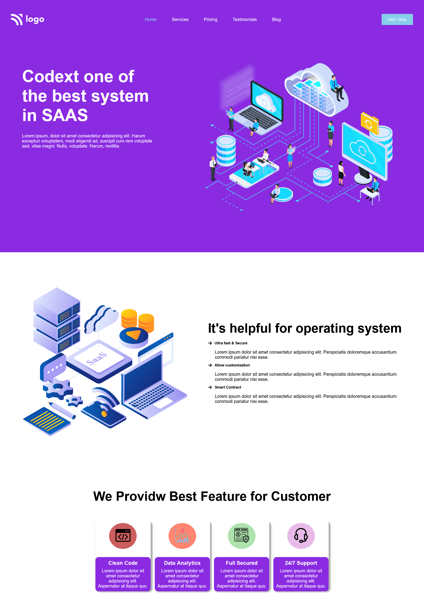

# SAAS Landing Page

## Table of contents

- [SAAS Landing Page](#saas-landing-page)
  - [Table of contents](#table-of-contents)
  - [Overview](#overview)
    - [The challenge](#the-challenge)
    - [Screenshot](#screenshot)
  - [My Process](#my-process)
    - [Built with](#built-with)
    - [What I learned](#what-i-learned)
    - [Continued Developement](#continued-developement)
  - [Author](#author)
  

## Overview

### The challenge

Make a Sass Landing Page .

### Screenshot

## My Process

### Built with 

- Semantic HTML5 markup
- CSS custom poperties
- Flexbox

### What I learned

- Learn how to use font icons .
- Learn how to use css :: before selector with hover effect .
- Learn how to use other pseudo selector like nth() child .

### Continued Developement

- I want to do more practice on pseudo selectors.

## Author

- Kapil Kharera
- Linkedin - [Kapil Kharera](https://www.linkedin.com/in/kapil-kharera-191b83245/)